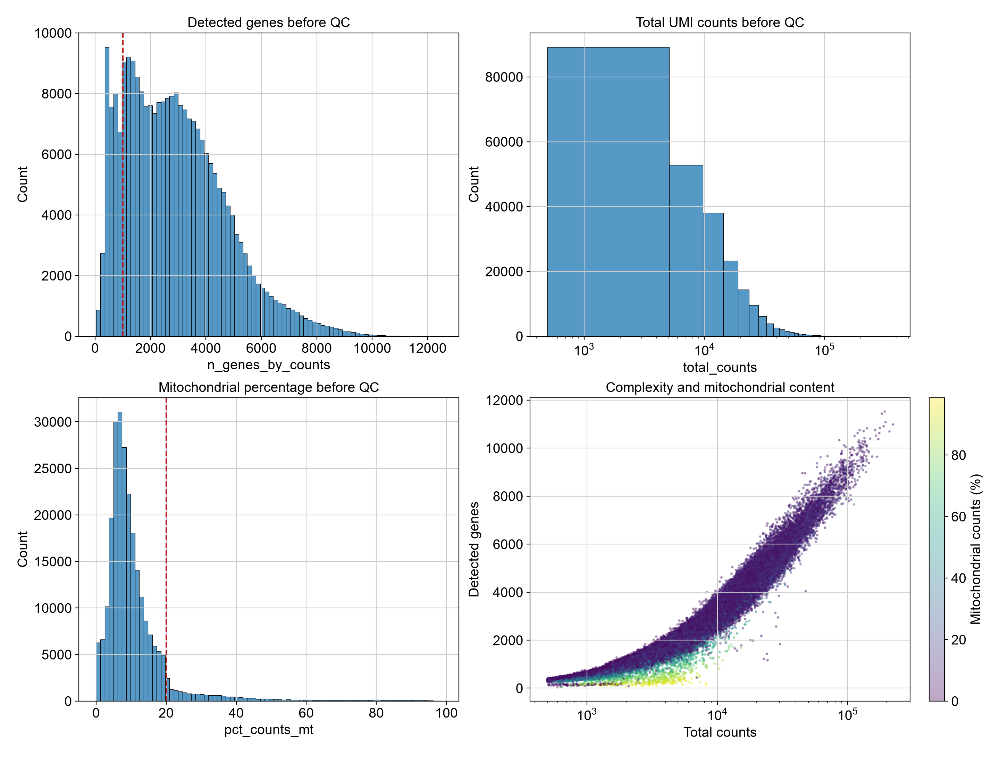
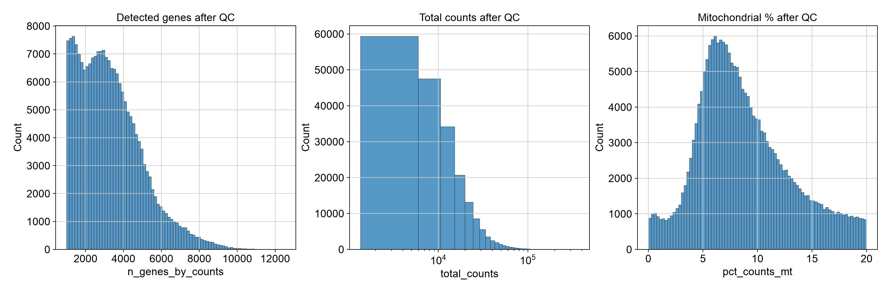
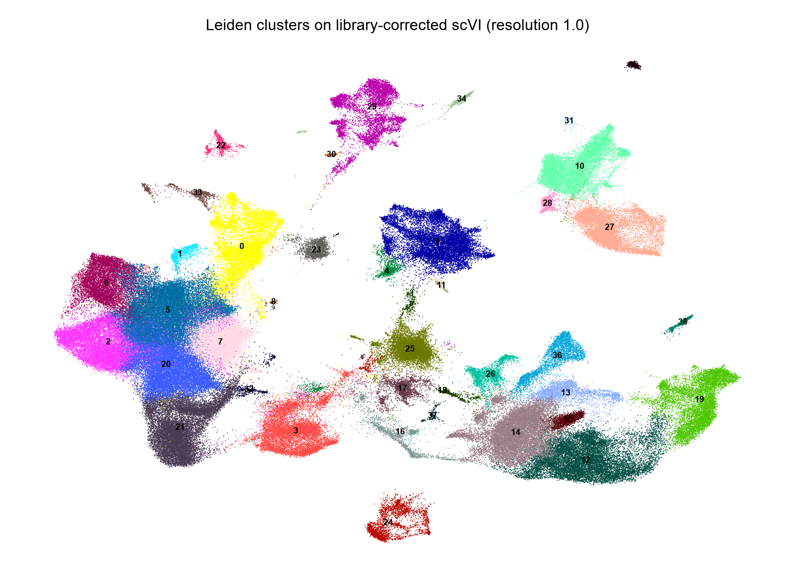
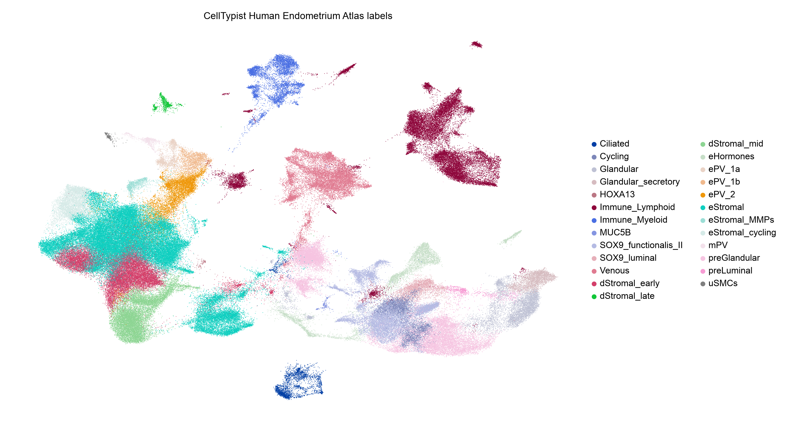
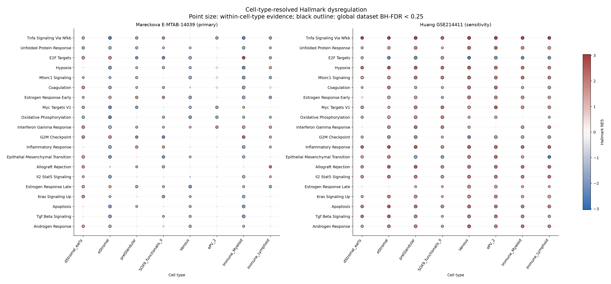
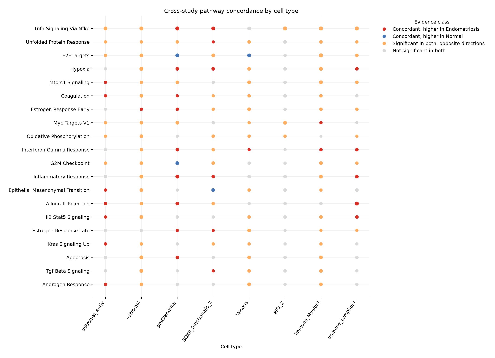
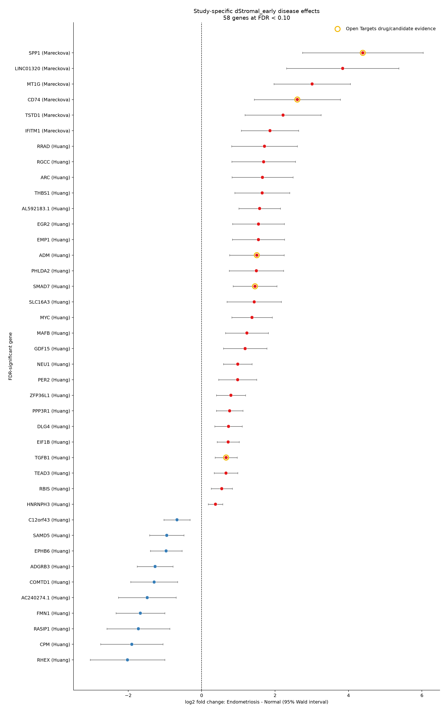

# Endometriosis single-cell RNA-seq analysis

This project reanalyzes human endometrial single-cell RNA-sequencing data to characterize cell states, resolve endometriosis-associated pathway dysregulation by cell type, and test a genetically motivated early decidualized stromal state (`dStromal_early`) in greater depth. The current workflow is implemented in [`code/notebooks/endometriosis_scRNAseq_analysis.ipynb`](code/notebooks/endometriosis_scRNAseq_analysis.ipynb).

The analysis combines the newly generated Marečková cohort from [E-MTAB-14039](https://www.ebi.ac.uk/biostudies/arrayexpress/studies/E-MTAB-14039) with the Huang cohort ([GSE214411](https://www.ncbi.nlm.nih.gov/geo/query/acc.cgi?acc=GSE214411)). Its biological and methodological starting point is Marečková et al., [*An integrated single-cell reference atlas of the human endometrium*](https://www.nature.com/articles/s41588-024-01873-w), published in *Nature Genetics* in 2024.

## Research question and hypothesis

Marečková et al. identified `dStromal_early`, `dStromal_mid`, uM1 and uM2 among the cell states most enriched for expression of genes positionally close to endometriosis risk variants in their functional GWAS analysis. They also described `dStromal_early` as an early-secretory-phase decidualized stromal state.

> **Working hypothesis:** because early decidualized stromal cells were among the cell types most enriched for expression of genes near endometriosis risk variants, `dStromal_early` should exhibit a donor-level, disease-associated transcriptional program. Even if individual differentially expressed genes do not replicate across small cohorts, coordinated pathways involved in decidualization, stromal remodeling and inflammatory communication should show concordant direction in Marečková and Huang. Comparing the same pathways across other major cell types should distinguish a `dStromal_early`-localized mechanism from multicellular or tissue-wide dysregulation.

This is a testable prediction rather than a necessary consequence of the fGWAS result. Cell-type enrichment for genes near risk variants identifies a genetically relevant cellular context, but it does not establish case-control differential expression, pathway direction, cell-type specificity or therapeutic tractability. Marečková is therefore treated as the primary cohort, while Huang is modeled separately as independent sensitivity evidence rather than pooled with the discovery data.

## Input data

| Cohort | Local input | Input structure | Metadata |
|---|---|---|---|
| Marečková, E-MTAB-14039 | `data/work/` | Filtered 10x matrices packaged by sequencing library | [`metadata/sample_metadata.csv`](metadata/sample_metadata.csv) |
| Huang, GSE214411 | `huang_data/GSE214411_RAW.tar` | Thirteen prefixed 10x matrices: six endometriosis and seven control donors | [`metadata/huang_sample_metadata.csv`](metadata/huang_sample_metadata.csv) |

Each library is initially read as a separate raw-count `AnnData`. Cross-study identifiers are namespaced, curated biological metadata are attached to `.obs`, and the samples are combined over shared Ensembl gene identifiers. Integer counts are retained in `layers['counts']` for count-based modeling.

### Why Huang was the only external atlas dataset added

This project is a focused disease-comparison analysis rather than an attempt to reconstruct all seven datasets in the published HECA. Huang was selected as the single external cohort because it satisfies the requirements of the planned donor-level `dStromal_early` analysis:

- raw gene-by-cell count matrices are available in a compatible 10x-like format;
- donor identities are retained, allowing cells to be aggregated into independent donor pseudobulks;
- the cohort contains both endometriosis and control donors within the same originating study—six cases and seven controls after metadata harmonization;
- natural-cycle, untreated, eutopic endometrial samples and menstrual-stage information can be selected using variables compatible with the Marečková metadata;
- `dStromal_early` cells are represented after a common QC and CellTypist annotation workflow; and
- it adds independent biological donors while keeping the number of study-specific technical contexts small enough to audit directly.

The other HECA inputs were not added merely to increase the number of cells. For donor-level DE, more cells from an unsuitable or single-condition dataset do not replace additional independent case and control donors. Every extra source would require its own audit of raw-count availability, donor identifiers, disease balance, menstrual phase, hormone exposure, tissue compartment, protocol and recovery of the target cell state. Including sources that cannot support a within-study Endometriosis-versus-Normal contrast could increase technical and compositional heterogeneity without directly identifying the disease coefficient. Huang therefore provides a deliberately limited external sensitivity cohort; it should not be interpreted as proving that the result generalizes to every dataset in the atlas.

## Notebook workflow

### 1. Data loading and metadata

The notebook discovers and streams the 10x matrices, validates unique feature and cell identifiers, constructs one `AnnData` per library, attaches donor and clinical metadata, and combines the Marečková and Huang cohorts.

### 2. Quality control and preprocessing

The primary cell filters follow the paper at a high level:

- at least 1,000 detected genes per cell;
- no more than 20% mitochondrial counts;
- Scrublet scoring performed independently for each sequencing library;
- predicted doublets retained in the general atlas but excluded from the downstream `dStromal_early` DE cohort;
- normalization to 10,000 counts per cell followed by `log1p`;
- cell-cycle scoring without regressing cell-cycle signal from expression;
- exclusion of the CDK1-associated cycling-gene module from integration features while retaining those genes for annotation and DE.

Across both cohorts, 204,385 of 249,684 cells passed the gene-count and mitochondrial filters (81.9%).

| Disease group | Cells before QC | Cells after QC | Retained |
|---|---:|---:|---:|
| Control | 114,328 | 88,364 | 77.3% |
| Endometriosis | 135,356 | 116,021 | 85.7% |
| **Total** | **249,684** | **204,385** | **81.9%** |

#### QC before filtering

The red dashed lines mark the minimum detected-gene and maximum mitochondrial-percentage thresholds.



#### QC after filtering



### 3. scVI integration, clustering and cell typing

The notebook selects 2,000 library-aware highly variable genes, removes the inferred cycling module from the integration feature set, and trains scVI on raw counts using `library_id` as the technical batch key. The 30-dimensional scVI latent representation is used for the neighbor graph, UMAP and Leiden clustering. scVI-decoded expression is not used for cell typing or DE.

Leiden clustering is performed at resolution 1.0:



Cell types are predicted from log-CP10K expression with CellTypist's `Human_Endometrium_Atlas.pkl` model and over-cluster majority voting. The scVI coordinates provide the visualization but are not classifier input.



### 4. Canonical donor-level differential expression and pathway analysis

The inferential analysis retains natural-cycle, untreated, eutopic endometrial samples, excludes Scrublet-predicted doublets, and requires at least 20 retained cells of a given type per donor. Raw counts are summed into one pseudobulk per biological donor. A cell-type model requires at least three Normal and three Endometriosis donors within each study.

Eight major compartments satisfy these criteria in both cohorts: `dStromal_early`, `eStromal`, `preGlandular`, `SOX9_functionalis_II`, `Venous`, `ePV_2`, `Immune_Myeloid` and `Immune_Lymphoid`. All 16 planned cell-type-by-study models fitted successfully. Marečková and Huang are modeled separately with PyDESeq2:

```text
~ cycle_group + disease_group
```

The menstrual-cycle term is retained when estimable. The reported contrast is Endometriosis minus Normal, and gene-level false discovery rate is controlled separately within each cell-type and dataset at 0.10. Hallmark pathways are tested from the complete DESeq2 Wald-statistic ranking using weighted preranked GSEA. Pathway P values are adjusted both across the 50 Hallmarks within each cell type and across all cell-type-by-pathway tests within each dataset. There is no pooled disease-effect model and individual cells are never treated as replicates.





Across the eight cell types, 52 pathway-cell-type pairs have within-cell-type BH-FDR below 0.25 in both cohorts and matching normalized enrichment-score direction. The `dStromal_early` state contributes nine concordant pathways, all higher in Endometriosis:

- allograft rejection;
- androgen response;
- coagulation;
- epithelial-mesenchymal transition;
- IL2-STAT5 signaling;
- KRAS signaling up;
- mTORC1 signaling;
- myogenesis; and
- UV response down.

Within `dStromal_early`, 31 Hallmarks pass the exploratory threshold in Marečková and 32 in Huang. Nineteen are significant in both, but only the nine listed above agree in direction; the other ten are directionally discordant and are not interpreted as replicated mechanisms.

The comparison refines the specificity claim. Androgen response, KRAS signaling up, mTORC1 signaling and UV response down are concordant only in `dStromal_early` among the eight tested states. Coagulation and IL2-STAT5 recur with the same direction in one other compartment, while allograft rejection also recurs in `preGlandular` and `Immune_Lymphoid`. Epithelial-mesenchymal transition and myogenesis recur in `SOX9_functionalis_II`, but with the opposite direction, demonstrating that a shared pathway name need not represent the same cell-type program.

#### Focal `dStromal_early` gene-level findings

The focal section is now a prespecified view of the canonical cell-type models rather than a second DE or GSEA run. `dStromal_early` is an early-secretory-associated cell state; donor metadata are not additionally restricted to `menstrual_cycle_stage_fine == 'Secretory Early'` because that subset cannot support inferential modeling in both cohorts.

| Dataset | Donors (Normal / Endometriosis) | Genes tested | FDR < 0.10 | Higher in endometriosis | Higher in Normal |
|---|---:|---:|---:|---:|---:|
| Marečková E-MTAB-14039 | 8 (3 / 5) | 13,803 | 12 | 11 | 1 |
| Huang GSE214411 | 13 (7 / 6) | 14,606 | 46 | 32 | 14 |

The current results contain 58 unique FDR-significant gene-study associations. None is significant in both datasets at FDR < 0.10, so these findings are study-specific and should not be described as cross-study replication. Leading results include `MT1G`, `SPP1`, `LINC01320`, `IFITM1` and `CD74` in Marečková, and `AL592183.1`, `ADGRB3`, `NEU1`, `FMN1` and `MYC` in Huang.

The figure shows the 40 most significant associations by adjusted P value. Positive log2 fold changes indicate higher expression in endometriosis. Gold outlines identify genes with an Open Targets drug or clinical-candidate record; they do not demonstrate that the associated drug would treat endometriosis.



Six significant genes currently overlap Open Targets drug or clinical-candidate records. Positive log2 fold changes indicate higher expression in endometriosis; negative values indicate higher expression in controls.

| Dataset | Gene | log2 fold change | FDR | Open Targets drugs or candidates | Relationship to the nine concordant `dStromal_early` pathways |
|---|---|---:|---:|---|---|
| Marečková | `SPP1` | 4.390 | 0.0012 | ASK-8007 | Leading-edge gene in its source cohort |
| Marečková | `CD74` | 2.606 | 0.0355 | Milatuzumab; repotrectinib | Leading-edge gene in its source cohort |
| Huang | `SMAD7` | 1.453 | 0.0039 | Mongersen sodium | Leading-edge gene in its source cohort |
| Huang | `TGFB1` | 0.667 | 0.0169 | Bintrafusp alfa; fresolimumab; luspatercept; LY-2382770; metelimumab | Leading-edge gene in its source cohort |
| Huang | `ADM` | 1.503 | 0.0480 | Enibarcimab | DE-only candidate relative to the nine concordant sets |
| Huang | `VWF` | -1.818 | 0.0946 | Caplacizumab; egaptivon pegol; von Willebrand factor products | Coagulation-set member, but not a source-cohort leading-edge gene |

Drug-target status is annotation layered onto the DE results and does not affect statistical significance. `SPP1`, `CD74`, `TGFB1` and `SMAD7` connect the gene-level and pathway-level analyses, but only in the cohort where each gene was detected. No candidate is a leading-edge driver in both studies. A database association can represent direct binding, modulation of an RNA or protein, replacement therapy, or activity against a fusion containing the gene; the entries are therefore hypotheses for follow-up rather than treatment recommendations.

#### CD74 example

In the Marečková-specific model, `CD74` was higher in endometriosis (`log2FoldChange = 2.606`, approximately 6.1-fold; `FDR = 0.0355`). [NCBI Gene](https://www.ncbi.nlm.nih.gov/gene/972) describes CD74 as the MHC class II invariant-chain chaperone involved in antigen presentation. CD74 can also act as a cell-surface receptor for macrophage migration inhibitory factor (MIF), connecting it to survival, proliferation and inflammatory signaling. Its elevation in the selected stromal cells is therefore compatible with altered immune-interaction or inflammatory signaling, although transcript abundance alone does not establish the active mechanism or confirm cell-surface protein abundance.

Two oncology-related records were returned for `CD74`, but they have different meanings:

- [Milatuzumab](https://www.cancer.gov/publications/dictionaries/cancer-drug/def/milatuzumab) is an investigational humanized monoclonal antibody that directly binds CD74 on CD74-positive cells. It has been studied as an antineoplastic agent, not as an endometriosis treatment.
- [Repotrectinib](https://www.accessdata.fda.gov/drugsatfda_docs/nda/2023/218213Orig1s000Lbl.pdf) is an approved ROS1/TRK kinase inhibitor used in molecularly selected cancers. Its CD74 association arises from oncogenic `CD74–ROS1` fusions; it does not mean that repotrectinib inhibits ordinary CD74 expressed by `dStromal_early` cells.

Consequently, `CD74` is a statistically supported, pharmacologically annotated candidate in the Marečková analysis, but neither record currently demonstrates therapeutic relevance to endometriosis. Follow-up would require confirmation of CD74 protein localization, evidence that CD74/MIF signaling contributes to the disease phenotype, perturbation experiments in an appropriate endometrial model, and independent donor validation.

Full consolidated result tables are available in [`results/differential_expression/revised_analysis/`](results/differential_expression/revised_analysis/). Cell-type-resolved DE, Hallmark GSEA and concordance tables are under [`cell_type_pathways/`](results/differential_expression/revised_analysis/cell_type_pathways/); focal exports, pathway-supported drug candidates, figures and the evidence summary remain at the top level for convenience.

## Hypothesis evaluation and principal finding

The working hypothesis is **supported at the pathway level but not at the individual-gene replication level**.

The primary Marečková analysis identifies 12 FDR-significant `dStromal_early` genes and the independent Huang sensitivity analysis identifies 46. Most are higher in Endometriosis, but no individual gene passes FDR < 0.10 in both cohorts. The analysis therefore does not establish a replicated cross-study gene signature.

The full ranked expression profiles nevertheless converge on nine `dStromal_early` Hallmark programs with matching positive direction and within-cell-type FDR < 0.25 in both cohorts. The cell-type screen further shows that four of these—mTORC1 signaling, KRAS signaling up, androgen response and UV response down—are concordant only in `dStromal_early` among the eight tested states. This provides cross-study evidence for a coordinated, cell-state-dependent program that is not apparent from overlap of significant genes alone.

The principal biological finding is therefore that endometriosis-associated transcriptional dysregulation is organized at the pathway and cell-type levels: `dStromal_early` shows reproducible positive enrichment of remodeling, signaling and immune-interaction programs, while related pathways can be shared, absent or oppositely directed in other endometrial compartments. The genetic rationale supports studying this state, but the pathway screen—not the fGWAS enrichment alone—provides the disease-associated functional evidence.

The resulting therapeutic hypothesis is to test **partial mTORC1 attenuation as a mechanistic probe** in donor-derived stromal-cell decidualization models, measuring whether it rescues the disease-associated remodeling program while preserving decidual function. This is not a treatment recommendation. It requires protein or activity-level confirmation, perturbational validation, dose-response assessment and replication in additional donors.

Important limitations remain: Marečková includes only three Normal donors in the focal model; fine menstrual-stage matching is incomplete; cell-type labels are transferred computationally; transcript abundance does not establish protein activity; and the pathway FDR threshold is exploratory. The secretory-only descriptive sensitivity retains the full-model direction in all eight key-gene-by-study comparisons, but its donor counts are too small for separate inference.

## Reproducible environment

Create the Conda environment from the repository root:

```bash
conda env create --file environment/environment.yml
```

Register it as a Jupyter kernel:

```bash
conda run --name endometriosis-study \
  python -m ipykernel install --user \
  --name endometriosis-study \
  --display-name "Endometriosis study"
```

Open [`code/notebooks/endometriosis_scRNAseq_analysis.ipynb`](code/notebooks/endometriosis_scRNAseq_analysis.ipynb) in JupyterLab or an IDE and select the **Endometriosis study** kernel. The focal `dStromal_early` tables and figures are derived from the same canonical cell-type models; the notebook does not rerun focal DESeq2 or GSEA.

## Main outputs

| Output | Location |
|---|---|
| QC tables and figures | [`results/qc/`](results/qc/) |
| CellTypist annotations and figures | [`results/cell_typing/`](results/cell_typing/) |
| Consolidated focal DE, pathway, sensitivity and drug-target results | [`results/differential_expression/revised_analysis/`](results/differential_expression/revised_analysis/) |
| Cell-type-resolved DE, Hallmark GSEA and cross-study concordance | [`results/differential_expression/revised_analysis/cell_type_pathways/`](results/differential_expression/revised_analysis/cell_type_pathways/) |
| Consolidation equivalence report | [`results/differential_expression/revised_analysis/consolidation_equivalence_summary.csv`](results/differential_expression/revised_analysis/consolidation_equivalence_summary.csv) |
| Filtered and integrated `AnnData` objects | `data/processed/` |
| Cached CellTypist and scVI models | `data/models/` and `data/processed/scvi_model/` |
